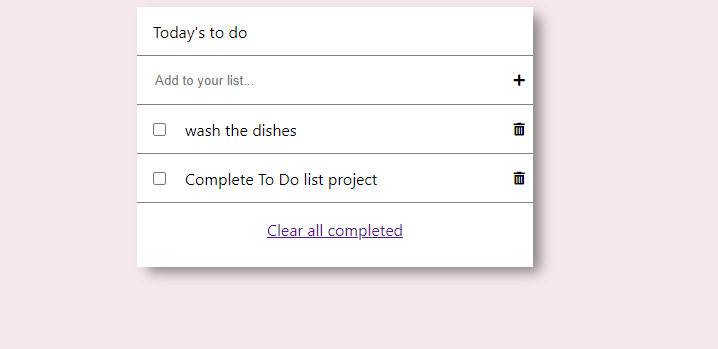

# To Do List

This project was created with the objetive of complete the first milestone of the "To Do List" project, it shows default Tasks in example of how is gonna be when you add more tasks.

## Built With

- HTML, JavaScript & CSS

## Live Demo

[Live Demo Link](https://marcosmerida.github.io/Awesome-Books/)

## Instalation

To get a local copy up and running follow these simple example steps.
- Open terminal
- Clone this project by command git clone https://github.com/marcosmerida/To-Do-List/tree/Test
- cd to /dist folder
- Open index.html in browser

### Prerequisites

- IDE to edit and run the code (We've used Visual Studio Code 🔥).

### Usage

- For anyone who wants to practice HTML5 and JavaScript.
- How to storage data locally in the browser and Array practices.
- Array and objects methods.
- Implementation of webpack set up.

## Authors

👤 **Juan Marcos Mérida**

- GitHub: [@githubhandle](https://github.com/marcosmerida)
- LinkedIn: [LinkedIn](https://linkedin.com/in/marcos-merida-219437206/)

## Show your support

Give a ⭐️ if you like this project!
